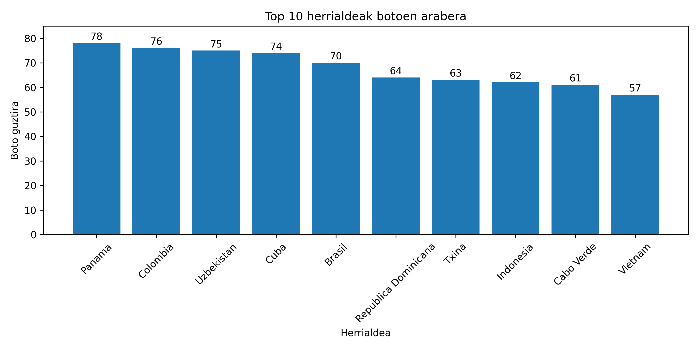
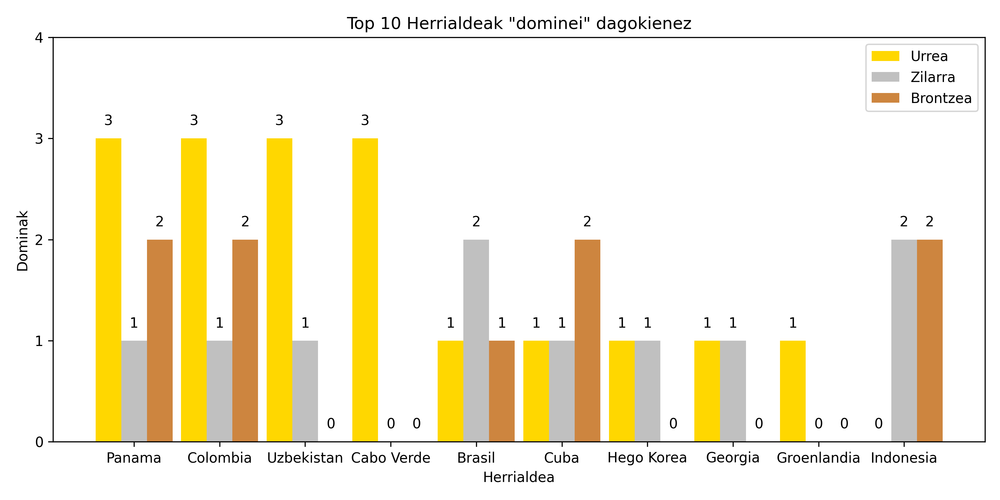

# 30 urte - bidaia nora?

Datu zientzia apurtxo bat Leireren inkestaren emaitzekin.

Leiereren PDFtik hartu ditut datuak. Eskuz kopiatu ditut beraz baliteke akatsak egotea!

## Emaitzen laburpena:

### TOP10 botoen arabera

### "Olimpiadak"
Ze herrialdek jaso dute 10, 9 eta 8ko boto gehien?

### Punteria
Zeinek eman du gero TOP10ean bukatu duten herrialdeen alde bozka gehien? Hau da, zeinek du punteria hobea?

| # | Izena    | Asmatuak |
|---|----------|----------|
| 1 | Leire V. | 8        |
| 2 | Beñat     | 7        |
| 2 | Mireia    | 7        |
| 4 | Andoni    | 6        |
| 4 | Lide      | 6        |
| 4 | Andrea    | 6        |
| 4 | Xabier D. | 6        |
| 4 | Cristina  | 6        |

Taula osoa:

    bigarren_fasea_bozkatuak_top10ean.tsv
